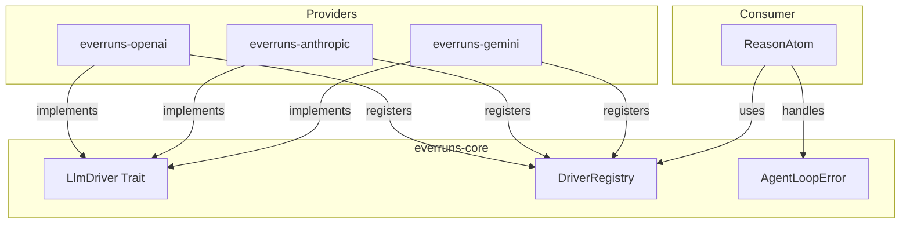
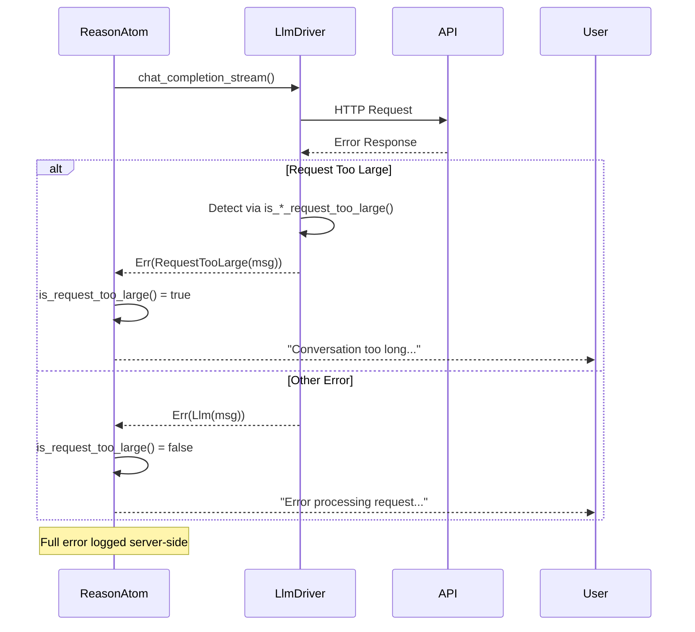

# LLM Drivers Specification

## Abstract

LLM drivers provide a provider-agnostic interface for interacting with Large Language Model APIs. The driver abstraction enables dependency inversion - provider implementations (OpenAI, Anthropic) register their drivers at startup, while core business logic operates against the trait interface.

## Architecture



## Requirements

### LlmDriver Trait

1. **Trait Definition** (`everruns-core::llm_driver_registry`):
   ```rust
   #[async_trait]
   pub trait LlmDriver: Send + Sync {
       async fn chat_completion_stream(
           &self,
           messages: Vec<LlmMessage>,
           config: &LlmCallConfig,
       ) -> Result<LlmResponseStream>;
   }
   ```

2. **Streaming Response**: Drivers MUST return a stream of `LlmStreamEvent`:
   - `TextDelta(String)` - Incremental text content
   - `ToolCalls(Vec<ToolCall>)` - Tool calls from the LLM
   - `Done(LlmCompletionMetadata)` - Stream completed with metadata
   - `Error(String)` - Error during streaming

3. **Provider Types**: Supported provider types are defined in `ProviderType` enum:
   - `OpenAI` - OpenAI API using Open Responses API (recommended)
   - `OpenAICompletions` - OpenAI API using Chat Completions API (legacy)
   - `Anthropic` - Anthropic Claude API
   - `Gemini` - Google Gemini API
   - `LlmSim` - Testing simulator (llmsim crate)

### Error Types (Contract)

Drivers MUST use the following error types from `AgentLoopError`:

1. **`Llm(String)`** - Generic LLM provider error
   - Use for: network errors, authentication failures, invalid requests, server errors
   - Example: `AgentLoopError::llm("OpenAI API error (500): Internal server error")`

2. **`RequestTooLarge(String)`** - Context length or token limit exceeded
   - Use for: context length exceeded, token limits hit, prompt too long
   - Drivers MUST detect provider-specific error responses and convert to this type
   - Example: `AgentLoopError::request_too_large("OpenAI API error (429): Request too large...")`

### Error Detection Requirements

Each driver MUST implement provider-specific error detection:

#### OpenAI Driver

Detect `RequestTooLarge` for:
- HTTP 429 with "Request too large" in message
- HTTP 429 with "tokens" and "limit" in message (TPM exceeded)
- HTTP 400 with "context_length_exceeded" code
- HTTP 400 with "maximum context length" in message
- Any response with "tokens must be reduced" or "reduce the length"

#### Anthropic Driver

Detect `RequestTooLarge` for:
- HTTP 413 (Payload Too Large)
- HTTP 400 with "prompt is too long" in message
- HTTP 400 with "request size exceeded" in message
- HTTP 400 with "too many tokens" in message
- Any response with "maximum context" or "exceeds the maximum"

#### Gemini Driver

Detect `RequestTooLarge` for:
- HTTP 413 (Payload Too Large)
- HTTP 400 with "request payload size exceeds" in message
- HTTP 400 with "exceeds the maximum" and "token" in message
- HTTP 400 with "content too large" in message
- Any response with "input is too long", "maximum context", or "token limit exceeded"

### Driver Registry

1. **Registration**: Provider crates register factories at startup:
   ```rust
   pub fn register_driver(registry: &mut DriverRegistry) {
       registry.register(ProviderType::OpenAI, |api_key, base_url| {
           Box::new(OpenAILlmDriver::new(api_key, base_url))
       });
   }
   ```

2. **Creation**: Drivers are created on-demand from `ProviderConfig`:
   ```rust
   let driver = registry.create_driver(&config)?;
   ```

3. **API Key Requirement**: All real providers require API keys. `LlmSim` is exempted for testing.

### Message Types

1. **LlmMessage**: Provider-agnostic message format
   - `role`: System, User, Assistant, Tool
   - `content`: Text or multipart (text, images, audio)
   - `tool_calls`: Optional tool calls (assistant messages)
   - `tool_call_id`: Optional tool call reference (tool messages)

   **Image Content in Tool Results**: When a tool returns images (via `ToolResultImage`), they become `LlmContentPart::Image` entries in the Tool message's content. Provider-specific handling:
   - **Anthropic**: Tool results with images use array `content` in `tool_result` block (text + image blocks)
   - **OpenAI Chat Completions**: Tool messages include `image_url` content parts alongside text
   - **OpenAI Responses API**: Images not supported in `function_call_output` (text only, images dropped with warning)

2. **LlmCallConfig**: Configuration for LLM calls
   - `model`: Model identifier
   - `temperature`: Optional sampling temperature
   - `max_tokens`: Optional token limit
   - `tools`: Tool definitions
   - `reasoning_effort`: Optional reasoning level (low, medium, high)

3. **LlmMessage Extended Fields**:
   - `thinking`: Optional thinking content from extended thinking models
   - `thinking_signature`: Optional cryptographic signature for thinking (Anthropic)

### Extended Thinking Support

Extended thinking allows models to perform chain-of-thought reasoning before generating responses. This is supported by Anthropic Claude models.

#### Stream Events

When `reasoning_effort` is configured, drivers emit additional stream events:
- `ThinkingDelta(String)` - Incremental thinking content
- `ThinkingSignature(String)` - Cryptographic signature for thinking (Anthropic-specific)

#### Anthropic-Specific Requirements

1. **Beta Header for Tool Use**: When extended thinking is enabled AND tools are present, include:
   ```
   anthropic-beta: interleaved-thinking-2025-05-14
   ```
   This enables interleaved thinking where Claude can reason between tool calls.

2. **Thinking Signature**: Anthropic returns a cryptographic signature with thinking content via `content_block_stop` events. This signature MUST be:
   - Captured from the stream response
   - Stored with the assistant message
   - Sent back with the thinking content in subsequent API calls

3. **Multi-turn Requirements**: When sending conversation history to Anthropic with thinking enabled:
   - Every assistant message with thinking MUST include both `thinking` and `signature`
   - Thinking block MUST appear before `tool_use` blocks in message content
   - Without proper signatures, Anthropic returns: `"Expected 'thinking' or 'redacted_thinking', but found 'tool_use'"`

4. **Budget Tokens**: The thinking budget is derived from `reasoning_effort`:
   - `low`: 10,000 tokens
   - `medium`: 50,000 tokens
   - `high`: 100,000 tokens

### Completion Metadata

`LlmCompletionMetadata` returned on stream completion:
- `total_tokens`: Total tokens used
- `prompt_tokens`: Input tokens
- `completion_tokens`: Output tokens
- `cache_read_tokens`: Tokens from cache (provider-specific)
- `cache_creation_tokens`: Tokens written to cache (Anthropic)
- `model`: Actual model used
- `finish_reason`: Why generation stopped

## Error Handling Flow



## Implementation Location

| Component | Location |
|-----------|----------|
| LlmDriver trait | `crates/core/src/llm_driver_registry.rs` |
| AgentLoopError | `crates/core/src/error.rs` |
| OpenAI driver | `crates/openai/src/driver.rs` |
| Open Responses protocol | `crates/core/src/openresponses_protocol.rs` |
| Chat Completions protocol | `crates/core/src/openai_protocol.rs` |
| Anthropic driver | `crates/anthropic/src/driver.rs` |
| Gemini driver | `crates/gemini/src/driver.rs` |
| Error handling | `crates/core/src/atoms/reason.rs` |

## OpenAI Driver Variants

The OpenAI crate provides two driver implementations:

1. **OpenAILlmDriver** (`ProviderType::OpenAI`)
   - Uses Open Responses API (https://www.openresponses.org/)
   - Recommended for new projects
   - Wraps `OpenResponsesProtocolLlmDriver`

2. **OpenAICompletionsLlmDriver** (`ProviderType::OpenAICompletions`)
   - Uses Chat Completions API (`/v1/chat/completions`)
   - For backward compatibility with legacy integrations
   - Wraps `OpenAIProtocolLlmDriver`

Both drivers share the same base URL handling and can work with OpenAI-compatible endpoints.

## Automatic Retry for Transient Errors

LLM drivers implement automatic retry with exponential backoff for transient errors. This follows official SDK behavior from OpenAI and Anthropic.

### Retry Configuration

Default retry config (matches official SDKs):
- **max_retries**: 2
- **initial_backoff**: 1 second
- **max_backoff**: 60 seconds
- **backoff_multiplier**: 2.0
- **jitter_factor**: ±25%

### Transient Error Detection

The following HTTP status codes trigger automatic retry:
- `408` - Request Timeout
- `409` - Conflict
- `429` - Too Many Requests (Rate Limited)
- `5xx` - Server Errors (except 501 Not Implemented)

### Rate Limit Header Support

Drivers parse provider-specific headers to determine retry timing:

**Standard Headers:**
- `retry-after` - Seconds to wait (integer or HTTP-date)
- `retry-after-ms` - Milliseconds to wait (used by OpenAI)

**Anthropic-specific:**
- `anthropic-ratelimit-requests-remaining`
- `anthropic-ratelimit-requests-reset`
- `anthropic-ratelimit-tokens-remaining`
- `anthropic-ratelimit-tokens-reset`

**OpenAI-specific:**
- `x-ratelimit-remaining-requests`
- `x-ratelimit-remaining-tokens`
- `x-ratelimit-reset-requests`
- `x-ratelimit-reset-tokens`

### Retry Metadata

On successful completion after retries, `LlmCompletionMetadata` includes:
```rust
pub struct RetryMetadata {
    pub attempts: u32,              // Total attempts (1 = no retries)
    pub total_retry_wait: Duration, // Total time spent waiting
    pub last_rate_limit_info: Option<RateLimitInfo>,
}
```

The `llm.generation` event includes retry info when retries occurred:
```rust
pub struct LlmRetryInfo {
    pub attempts: u32,
    pub total_wait_ms: u64,
}
```

### Implementation Details

1. **Retry-after cap**: Maximum wait time from `retry-after` headers is capped at 60 seconds
2. **Exponential backoff**: When no `retry-after` header, uses exponential backoff with jitter
3. **Rate limit type detection**: Distinguishes between request-based and token-based rate limits

## Context Compaction (OpenAI Responses API)

The `/v1/responses/compact` endpoint is a context-compression feature for the OpenAI Responses API. It reduces conversation context size when approaching the model's context window limit.

### How It Works

1. Send the current conversation window (the `input` items from `/v1/responses` calls)
2. The endpoint returns a compacted window where:
   - All prior **user messages** are kept verbatim
   - Prior assistant messages, tool calls/results, and encrypted reasoning are replaced by one encrypted **compaction item**
3. Use the returned `output` array as the `input` for the next `/v1/responses` call

### LlmDriver Trait Methods

```rust
#[async_trait]
pub trait LlmDriver: Send + Sync {
    // ... existing methods ...

    /// Check if this driver supports the compact endpoint
    fn supports_compact(&self) -> bool {
        false // Default: not supported
    }

    /// Compact a conversation to reduce context size
    async fn compact(&self, request: CompactRequest) -> Result<Option<CompactResponse>> {
        Ok(None) // Default: not supported
    }
}
```

### Request Types

```rust
pub struct CompactRequest {
    pub model: String,                     // Required
    pub input: Vec<CompactInputItem>,      // Conversation items
    pub previous_response_id: Option<String>, // Alternative to input
    pub instructions: Option<String>,      // Optional system prompt
}

pub enum CompactInputItem {
    Message { role: String, content: CompactContent },
    FunctionCall { call_id: String, name: String, arguments: String },
    FunctionCallOutput { call_id: String, output: String },
    Compaction { encrypted_content: String }, // From previous compact
}
```

### Response Types

```rust
pub struct CompactResponse {
    pub output: Vec<CompactOutputItem>,
    pub usage: Option<CompactUsage>,
}

pub enum CompactOutputItem {
    Message { role: String, content: CompactContent }, // User messages kept
    Compaction { encrypted_content: String },          // Encrypted context
}
```

### Usage Example

```rust
use everruns_core::{CompactRequest, CompactInputItem, CompactContent};

// Build compact request from conversation history
let request = CompactRequest {
    model: "gpt-4o".to_string(),
    input: vec![
        CompactInputItem::Message {
            role: "user".to_string(),
            content: CompactContent::Text("Hello!".to_string()),
        },
        // ... more conversation items
    ],
    previous_response_id: None,
    instructions: None,
};

// Check if driver supports compact
if driver.supports_compact() {
    let response = driver.compact(request).await?;
    if let Some(compact_response) = response {
        // Use compact_response.output as input for next /v1/responses call
    }
}
```

### Provider Support

| Provider | Compact Support |
|----------|----------------|
| OpenAI (Responses API) | Yes |
| OpenAI (Completions API) | No |
| Anthropic | No |
| Gemini | No |
| LlmSim | No |

## Testing

1. **Unit Tests**: Each driver MUST have tests for error detection functions
2. **LlmSim**: Use `ProviderType::LlmSim` for integration tests without real API keys
3. **Error Detection Tests**: Cover all documented error patterns for each provider
4. **Parametrized Integration Tests**: Use `rstest` matrix in `crates/core/tests/`:
   - `llm_test_matrix/mod.rs` — shared `ProviderModelConfig` structs and `all_providers_registry()`
   - `agent_run_basic.rs` — basic completion + tool call, parameterized over all providers
   - `agent_run_with_thinking.rs` — extended thinking, parameterized over thinking-capable providers
   - Add new providers: one `const` in `llm_test_matrix` + one `#[case]` per test function
   - Tests skip gracefully when provider API key env var is not set
