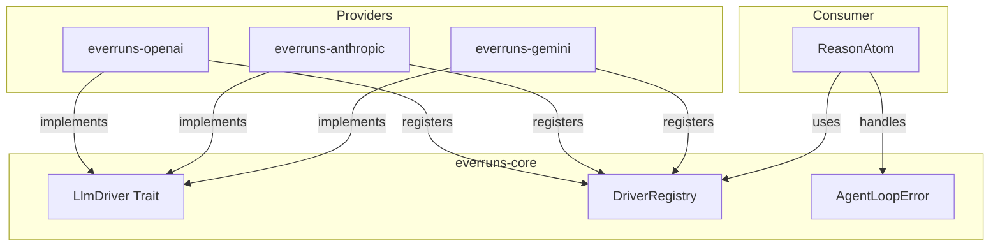
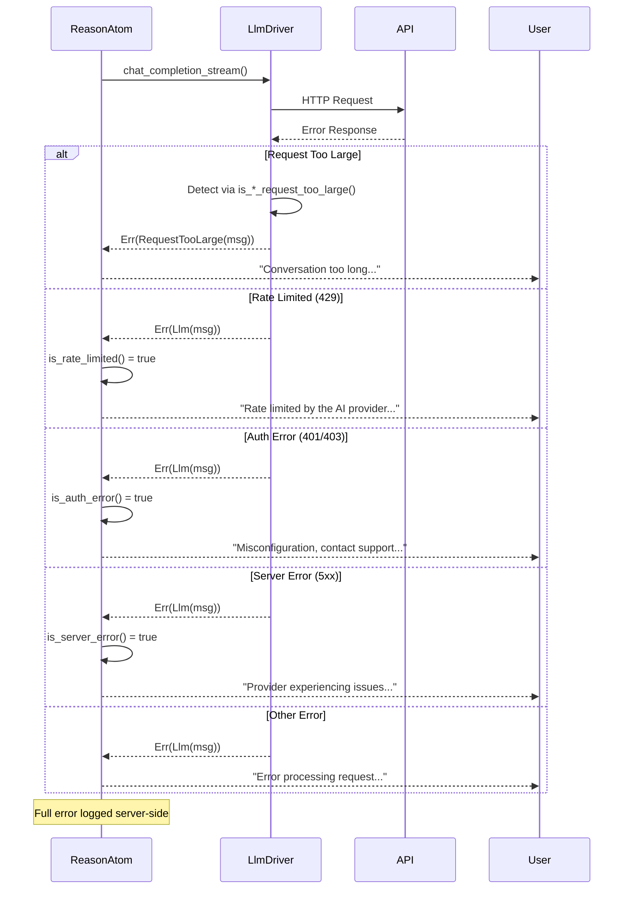

# LLM Drivers Specification

## Abstract

LLM drivers provide a provider-agnostic interface for interacting with Large Language Model APIs. The driver abstraction enables dependency inversion - provider implementations (OpenAI, Anthropic) register their drivers at startup, while core business logic operates against the trait interface.

## Architecture



## Requirements

### LlmDriver Trait

1. **Trait Definition**: See `crates/core/src/llm_driver_registry.rs` for `LlmDriver` trait, `LlmStreamEvent`, `ProviderType`, and `LlmCallConfig`.

2. **Streaming Response**: Drivers return a stream of `LlmStreamEvent` (TextDelta, ToolCalls, ThinkingDelta, ThinkingSignature, Done, Error).

3. **Provider Types**: `OpenAI` (Responses API), `OpenAICompletions` (Chat Completions), `Anthropic`, `Gemini`, `LlmSim` (testing).

### Error Types (Contract)

Drivers MUST use the following error types from `AgentLoopError`:

1. **`Llm(String)`** - Generic LLM provider error
   - Use for: network errors, authentication failures, invalid requests, server errors
   - Example: `AgentLoopError::llm("OpenAI API error (500): Internal server error")`

2. **`RequestTooLarge(String)`** - Context length or token limit exceeded
   - Use for: context length exceeded, token limits hit, prompt too long
   - Drivers MUST detect provider-specific error responses and convert to this type
   - Example: `AgentLoopError::request_too_large("OpenAI API error (429): Request too large...")`

### Error Detection Requirements

Each driver MUST implement provider-specific error detection:

#### OpenAI Driver

Detect `RequestTooLarge` for:
- HTTP 429 with "Request too large" in message
- HTTP 429 with "tokens" and "limit" in message (TPM exceeded)
- HTTP 400 with "context_length_exceeded" code
- HTTP 400 with "maximum context length" in message
- Any response with "tokens must be reduced" or "reduce the length"

#### Anthropic Driver

Detect `RequestTooLarge` for:
- HTTP 413 (Payload Too Large)
- HTTP 400 with "prompt is too long" in message
- HTTP 400 with "request size exceeded" in message
- HTTP 400 with "too many tokens" in message
- Any response with "maximum context" or "exceeds the maximum"

#### Gemini Driver

Detect `RequestTooLarge` for:
- HTTP 413 (Payload Too Large)
- HTTP 400 with "request payload size exceeds" in message
- HTTP 400 with "exceeds the maximum" and "token" in message
- HTTP 400 with "content too large" in message
- Any response with "input is too long", "maximum context", or "token limit exceeded"

### Driver Registry

Provider crates register factories at startup. Drivers created on-demand from `ProviderConfig`. All real providers require API keys; `LlmSim` exempted for testing. See `crates/core/src/llm_driver_registry.rs` for `DriverRegistry`.

### Message Types

1. **LlmMessage**: Provider-agnostic message format
   - `role`: System, User, Assistant, Tool
   - `content`: Text or multipart (text, images, audio)
   - `tool_calls`: Optional tool calls (assistant messages)
   - `tool_call_id`: Optional tool call reference (tool messages)

   **Image Content in Tool Results**: When a tool returns images (via `ToolResultImage`), they become `LlmContentPart::Image` entries in the Tool message's content. Provider-specific handling:
   - **Anthropic**: Tool results with images use array `content` in `tool_result` block (text + image blocks)
   - **OpenAI Chat Completions**: Tool messages include `image_url` content parts alongside text
   - **OpenAI Responses API**: Images not supported in `function_call_output` (text only, images dropped with warning)

2. **LlmCallConfig**: Configuration for LLM calls
   - `model`: Model identifier
   - `temperature`: Optional sampling temperature
   - `max_tokens`: Optional token limit
   - `tools`: Tool definitions
   - `reasoning_effort`: Optional reasoning level (low, medium, high)

3. **LlmMessage Extended Fields**:
   - `thinking`: Optional thinking content from extended thinking models
   - `thinking_signature`: Opaque token for multi-turn thinking context (provider-specific)

### Extended Thinking Support

Extended thinking allows models to perform chain-of-thought reasoning before generating responses. Supported by both Anthropic Claude and OpenAI o-series/GPT-5 models.

#### Stream Events

When `reasoning_effort` is configured, drivers emit additional stream events:
- `ThinkingDelta(String)` - Incremental thinking/reasoning content
- `ThinkingSignature(String)` - Opaque token for multi-turn context preservation

The `ThinkingSignature` event serves the same purpose across providers but with different semantics:
- **Anthropic**: Cryptographic signature for thinking content
- **OpenAI**: Encrypted reasoning content (`encrypted_content` from `ReasoningItem`)

#### Multi-turn Thinking Requirements

Both providers require preserved thinking context for multi-turn conversations:

| Field | Anthropic | OpenAI |
|-------|-----------|--------|
| `thinking` | Chain-of-thought text | Reasoning summary text |
| `thinking_signature` | Cryptographic signature | Encrypted content token |

When sending conversation history with thinking enabled:
- Every assistant message with thinking MUST include both fields
- The signature/token MUST be sent back to preserve reasoning context

#### Anthropic-Specific Requirements

1. **Beta Header for Tool Use**: When extended thinking is enabled AND tools are present, include:
   ```
   anthropic-beta: interleaved-thinking-2025-05-14
   ```
   This enables interleaved thinking where Claude can reason between tool calls.

2. **Thinking Signature**: Anthropic returns a cryptographic signature with thinking content via `content_block_stop` events. This signature MUST be:
   - Captured from the stream response
   - Stored with the assistant message
   - Sent back with the thinking content in subsequent API calls

3. **Message Ordering**: Thinking block MUST appear before `tool_use` blocks in message content.
   Without proper signatures, Anthropic returns: `"Expected 'thinking' or 'redacted_thinking', but found 'tool_use'"`

4. **Budget Tokens**: The thinking budget is derived from `reasoning_effort`:
   - `low`: 1,024 tokens
   - `medium`: 4,096 tokens
   - `high`: 16,384 tokens
   - `xhigh`: 32,768 tokens

#### OpenAI-Specific Requirements (Responses API)

1. **Reasoning Config**: The `reasoning` request parameter requires TWO fields:
   - `effort`: Reasoning depth (`none`, `low`, `medium`, `high`, `xhigh`)
   - `summary`: Must be `"detailed"` to receive reasoning tokens in the stream. Without this, reasoning happens internally but tokens are NOT exposed to the caller.

2. **Reasoning Events**: OpenAI emits reasoning via streaming events:
   - `response.reasoning.delta` - Incremental reasoning text (o-series models, opaque)
   - `response.reasoning_summary_text.delta` - Summary reasoning text (GPT-5.x, readable)
   - `response.output_item.done` with `reasoning` type - Contains `encrypted_content`

   Both delta event types map to `LlmStreamEvent::ThinkingDelta`.

3. **Provider Differences (o-series vs GPT-5.x)**:

   | Behavior | o-series (o1, o3) | GPT-5.x |
   |----------|-------------------|---------|
   | Reasoning event | `response.reasoning.delta` | `response.reasoning_summary_text.delta` |
   | Content type | Opaque/encrypted | Readable summary |
   | `encrypted_content` | Yes (in `OutputItem::Reasoning`) | No |
   | `thinking_signature` | Set from `encrypted_content` | Not used |
   | Reasoning trigger | Always (when effort > none) | Model decides based on question complexity |

4. **Encrypted Content**: OpenAI returns `encrypted_content` in `OutputItem::Reasoning` when the reasoning item completes (o-series models only). This MUST be:
   - Captured from the `response.output_item.done` event
   - Stored in `thinking_signature` field
   - Sent back as a `ReasoningItem` with `encrypted_content` in subsequent API calls

5. **Reasoning Item in Requests**: When sending conversation history with thinking:
   - Include a `Reasoning` input item BEFORE the assistant message
   - The `encrypted_content` field contains the preserved reasoning context

6. **Reasoning Effort Levels**: Supported values:
   - `none`: No reasoning
   - `low`: Minimal reasoning
   - `medium`: Moderate reasoning
   - `high`: Extensive reasoning
   - `xhigh`: Maximum reasoning

#### Reasoning Guard Logic

Reasoning parameters are validated at two levels to prevent API errors from non-thinking models:

1. **ReasonAtom (`reason.rs`)**: Before building the LLM call config:
   - Strips `reasoning_effort` when value is `"none"` (no-op)
   - Looks up model profile via `get_model_profile()` — if `reasoning: false`, strips reasoning_effort with a warning log
   - Unknown models (no profile) pass through to let the API decide

2. **Driver level**: Both OpenAI drivers filter out `effort: "none"` before sending:
   - Responses API: omits `reasoning` object entirely
   - Chat Completions API: omits `reasoning_effort` field

The UI also prevents setting reasoning on non-thinking models (checks `profile.reasoning` and `profile.reasoning_effort`).

### Completion Metadata

`LlmCompletionMetadata` returned on stream completion:
- `total_tokens`: Total tokens used
- `prompt_tokens`: Input tokens
- `completion_tokens`: Output tokens
- `cache_read_tokens`: Tokens from cache (provider-specific)
- `cache_creation_tokens`: Tokens written to cache (Anthropic)
- `model`: Actual model used
- `finish_reason`: Why generation stopped

## Error Handling Flow



## Implementation Location

| Component | Location |
|-----------|----------|
| LlmDriver trait | `crates/core/src/llm_driver_registry.rs` |
| AgentLoopError | `crates/core/src/error.rs` |
| OpenAI driver | `crates/openai/src/driver.rs` |
| Open Responses protocol | `crates/core/src/openresponses_protocol.rs` |
| Chat Completions protocol | `crates/core/src/openai_protocol.rs` |
| Anthropic driver | `crates/anthropic/src/driver.rs` |
| Gemini driver | `crates/gemini/src/driver.rs` |
| Error handling | `crates/core/src/atoms/reason.rs` |

## OpenAI Driver Variants

The OpenAI crate provides two driver implementations:

1. **OpenAILlmDriver** (`ProviderType::OpenAI`)
   - Uses Open Responses API (https://www.openresponses.org/)
   - Recommended for new projects
   - Wraps `OpenResponsesProtocolLlmDriver`

2. **OpenAICompletionsLlmDriver** (`ProviderType::OpenAICompletions`)
   - Uses Chat Completions API (`/v1/chat/completions`)
   - For backward compatibility with legacy integrations
   - Wraps `OpenAIProtocolLlmDriver`

Both drivers share the same base URL handling and can work with OpenAI-compatible endpoints.

## Automatic Retry for Transient Errors

LLM drivers implement automatic retry with exponential backoff for transient errors. This follows official SDK behavior from OpenAI and Anthropic.

### Retry Configuration

Default retry config (matches official SDKs):
- **max_retries**: 2
- **initial_backoff**: 1 second
- **max_backoff**: 60 seconds
- **backoff_multiplier**: 2.0
- **jitter_factor**: ±25%

### Transient Error Detection

The following HTTP status codes trigger automatic retry:
- `408` - Request Timeout
- `409` - Conflict
- `429` - Too Many Requests (Rate Limited)
- `5xx` - Server Errors (except 501 Not Implemented)

In-band stream errors (provider errors inside an accepted SSE stream) are **not** retried at the atom level to avoid duplicate user-visible error messages. The driver-level HTTP retry handles transient failures before the stream is established.

### Rate Limit Header Support

Drivers parse provider-specific headers to determine retry timing:

**Standard Headers:**
- `retry-after` - Seconds to wait (integer or HTTP-date)
- `retry-after-ms` - Milliseconds to wait (used by OpenAI)

**Anthropic-specific:**
- `anthropic-ratelimit-requests-remaining`
- `anthropic-ratelimit-requests-reset`
- `anthropic-ratelimit-tokens-remaining`
- `anthropic-ratelimit-tokens-reset`

**OpenAI-specific:**
- `x-ratelimit-remaining-requests`
- `x-ratelimit-remaining-tokens`
- `x-ratelimit-reset-requests`
- `x-ratelimit-reset-tokens`

### Retry Metadata

On successful completion after retries, `LlmCompletionMetadata` includes retry info (attempts, total wait time, rate limit info). The `llm.generation` event also includes retry info. See `crates/core/src/llm_driver_registry.rs` for `RetryMetadata`.

### Implementation Details

1. **Retry-after cap**: Maximum wait time from `retry-after` headers is capped at 60 seconds
2. **Exponential backoff**: When no `retry-after` header, uses exponential backoff with jitter
3. **Rate limit type detection**: Distinguishes between request-based and token-based rate limits

## Context Compaction (OpenAI Responses API)

The `/v1/responses/compact` endpoint is a context-compression feature for the OpenAI Responses API. It reduces conversation context size when approaching the model's context window limit.

### How It Works

1. Send the current conversation window (the `input` items from `/v1/responses` calls)
2. The endpoint returns a compacted window where:
   - All prior **user messages** are kept verbatim
   - Prior assistant messages, tool calls/results, and encrypted reasoning are replaced by one encrypted **compaction item**
3. Use the returned `output` array as the `input` for the next `/v1/responses` call

### LlmDriver Compact Methods

The `LlmDriver` trait includes `supports_compact()` and `compact()` methods. See `crates/core/src/llm_driver_registry.rs` for `CompactRequest`, `CompactInputItem`, `CompactResponse`, and `CompactOutputItem` types.

### Provider Support

| Provider | Compact Support |
|----------|----------------|
| OpenAI (Responses API) | Yes |
| OpenAI (Completions API) | No |
| Anthropic | No |
| Gemini | No |
| LlmSim | No |

## Testing

1. **Unit Tests**: Each driver MUST have tests for error detection functions
2. **LlmSim**: Use `ProviderType::LlmSim` for integration tests without real API keys
3. **Error Detection Tests**: Cover all documented error patterns for each provider
4. **Parametrized Integration Tests**: Use `rstest` matrix in `crates/core/tests/`:
   - `llm_test_matrix/mod.rs` — shared `ProviderModelConfig` structs and `all_providers_registry()`
   - `agent_run_basic.rs` — basic completion + tool call, parameterized over all providers
   - `agent_run_with_thinking.rs` — extended thinking, parameterized over thinking-capable providers
   - Add new providers: one `const` in `llm_test_matrix` + one `#[case]` per test function
   - Tests skip gracefully when provider API key env var is not set
