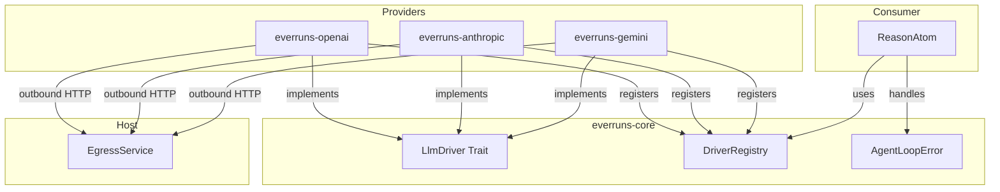
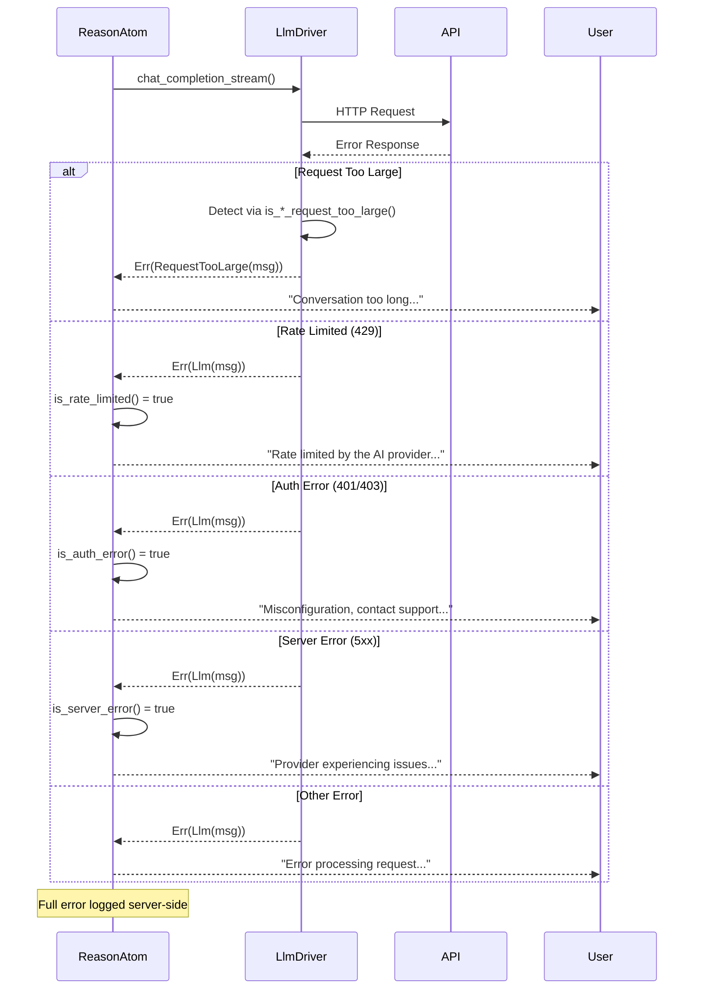

# LLM Drivers Specification

## Abstract

LLM drivers provide a provider-agnostic interface for interacting with Large Language Model APIs. The driver abstraction enables dependency inversion - provider implementations (OpenAI, Anthropic) register their drivers at startup, while core business logic operates against the trait interface.

## Architecture

## Requirements

### LlmDriver Trait

1. **Trait Definition**: See `crates/core/src/llm_driver_registry.rs` for `LlmDriver` trait, `LlmStreamEvent`, `ProviderType`, and `LlmCallConfig`.

2. **Streaming Response**: Drivers return a stream of `LlmStreamEvent` (TextDelta, ToolCalls, ThinkingDelta, ThinkingSignature, Done, Error).

3. **Provider Types**: `OpenAI` (Responses API), `OpenAICompletions` (Chat Completions), `Anthropic`, `Gemini`, `LlmSim` (testing).

### Error Types (Contract)

Drivers MUST use the following error types from `AgentLoopError`:

1. **`Llm(String)`** - Generic LLM provider error
   - Use for: network errors, authentication failures, invalid requests, server errors
   - Example: `AgentLoopError::llm("OpenAI API error (500): Internal server error")`

2. **`RequestTooLarge(String)`** - Context length or token limit exceeded
   - Use for: context length exceeded, token limits hit, prompt too long
   - Drivers MUST detect provider-specific error responses and convert to this type
   - Example: `AgentLoopError::request_too_large("OpenAI API error (429): Request too large...")`

### Error Detection Requirements

Each driver MUST implement provider-specific error detection to classify context-length and token-limit errors as `RequestTooLarge`. See the individual driver crates for the detection logic:
- `crates/openai/src/` — OpenAI error detection
- `crates/anthropic/src/` — Anthropic error detection
- `crates/gemini/src/` — Gemini error detection

### Driver Registry

Provider crates register factories at startup. Drivers created on-demand from `ProviderConfig`. All real providers require API keys; `LlmSim` exempted for testing. See `crates/core/src/llm_driver_registry.rs` for `DriverRegistry`.

### Egress Boundary

Provider drivers and model discovery must route outbound HTTP through
`EgressService` (see `specs/egress.md`). Drivers still own provider-specific
request construction, streaming parse logic, retry classification, and error
mapping, but they should not create direct external HTTP clients as the final
transport. This keeps workers and control-plane processes compatible with a
future remote Egress Gateway and airgapped deployments.

### Message Types

1. **LlmMessage**: Provider-agnostic message format
   - `role`: System, User, Assistant, Tool
   - `content`: Text or multipart (text, images, audio)
   - `tool_calls`: Optional tool calls (assistant messages)
   - `tool_call_id`: Optional tool call reference (tool messages)

   **Image Content in Tool Results**: When a tool returns images (via `ToolResultImage`), they become `LlmContentPart::Image` entries in the Tool message's content. Provider-specific handling:
   - **Anthropic**: Tool results with images use array `content` in `tool_result` block (text + image blocks)
   - **OpenAI Chat Completions**: Tool messages include `image_url` content parts alongside text
   - **OpenAI Responses API**: Images not supported in `function_call_output` (text only, images dropped with warning)

2. **LlmCallConfig**: Configuration for LLM calls
   - `model`: Model identifier
   - `temperature`: Optional sampling temperature
   - `max_tokens`: Optional token limit
   - `tools`: Tool definitions
   - `reasoning_effort`: Optional reasoning level (low, medium, high)
   - `metadata`: Optional request metadata for provider-side correlation
   - `previous_response_id`: Optional OpenAI Responses continuation handle
   - `tool_search`: Optional deferred tool-loading config
   - `prompt_cache`: Optional provider-agnostic prompt-cache config

### Prompt Cache Request Contract

Prompt caching is modeled as request intent on `LlmCallConfig.prompt_cache`. Drivers may ignore it when the provider or model does not support cache controls, but they must not fail a request solely because prompt caching was enabled.

Current provider mappings:

- **OpenAI Responses API** — derives a deterministic `prompt_cache_key` within OpenAI's 64-character request limit from stable cache-family inputs, not the changing per-turn transcript
- **Anthropic** — adds bounded `cache_control: { type: "ephemeral" }` breakpoints to stable/high-value request sections instead of every text block
- **Gemini** — uses `cachedContent` when the config includes an existing cached-content resource name; otherwise the request remains in implicit/default Gemini behavior

`llm.generation.metadata.request_options.prompt_cache` records which provider-specific mode the driver actually attempted.

### Default `max_tokens` Policy

When `config.max_tokens` is `None`, drivers resolve the default from model profile metadata rather than hardcoding a value:

1. Look up the model via `get_model_profile(provider_type, model_id)`
2. Use `profile.limits.output` as the default `max_tokens`
3. If no profile is found, fall back to a safe default (Anthropic: 16,384; Gemini: 8,192)
4. OpenAI drivers omit `max_tokens` entirely (API decides)

Anthropic requires `max_tokens` in every request (cannot be omitted), so the driver always resolves a value.

**Stale profile fallback**: If the Anthropic API returns 400 because `max_tokens` exceeds the model's actual limit (e.g., stale profile data), the driver retries once with 16,384 and logs a warning to update the model profile. If the retry also fails, the error propagates normally.

Agents can override `max_tokens` via agent config. Cost guardrails should be configurable per-agent or per-org, not baked into driver code.

3. **LlmMessage Extended Fields**:
   - `thinking`: Optional thinking content from extended thinking models
   - `thinking_signature`: Opaque token for multi-turn thinking context (provider-specific)

### Extended Thinking Support

Extended thinking allows models to perform chain-of-thought reasoning before generating responses. Supported by both Anthropic Claude and OpenAI o-series/GPT-5 models.

#### Stream Events

When `reasoning_effort` is configured, drivers emit additional stream events:
- `ThinkingDelta(String)` - Incremental thinking/reasoning content
- `ThinkingSignature(String)` - Opaque token for multi-turn context preservation

#### Multi-turn Thinking Contract

Both providers require preserved thinking context for multi-turn conversations. Every assistant message with thinking MUST include both `thinking` (content text) and `thinking_signature` (opaque token). The signature MUST be sent back in subsequent API calls to preserve reasoning context.

| Field | Anthropic | OpenAI (o-series) |
|-------|-----------|-------------------|
| `thinking` | Chain-of-thought text | Reasoning summary text |
| `thinking_signature` | Cryptographic signature | `encrypted_content` token |

Provider-specific wire format details live in the driver implementations:
- `crates/anthropic/src/driver.rs` -- beta headers, signature capture, message ordering, budget tokens
- `crates/openai/src/driver.rs` -- reasoning config, encrypted content, reasoning item format

#### Reasoning Guard Logic

Reasoning parameters are validated at two levels to prevent API errors from non-thinking models:

1. **ReasonAtom (`reason.rs`)**: Before building the LLM call config:
   - Strips `reasoning_effort` when value is `"none"` (no-op)
   - Looks up model profile via `get_model_profile()` — if `reasoning: false`, strips reasoning_effort with a warning log
   - Unknown models (no profile) pass through to let the API decide

2. **Driver level**: Both OpenAI drivers filter out `effort: "none"` before sending:
   - Responses API: omits `reasoning` object entirely
   - Chat Completions API: omits `reasoning_effort` field

The UI also prevents setting reasoning on non-thinking models (checks `profile.reasoning` and `profile.reasoning_effort`).

### Completion Metadata

`LlmCompletionMetadata` returned on stream completion:
- `total_tokens`: Total tokens used
- `prompt_tokens`: Input tokens
- `completion_tokens`: Output tokens
- `cache_read_tokens`: Tokens from cache (provider-specific)
- `cache_creation_tokens`: Tokens written to cache (Anthropic)
- `model`: Actual model used
- `finish_reason`: Why generation stopped

### Realtime Voice Driver

Realtime voice does not use `LlmDriver::chat_completion_stream()` because a
voice connection is a long-lived bidirectional provider session, not a bounded
request/response generation. Voice support adds a separate Realtime provider
adapter owned by the server voice domain. See [voice.md](voice.md).

V1 adapter requirements:

- OpenAI only, model `gpt-realtime-2`.
- Mint client secrets through `/v1/realtime/client_secrets` or proxy SDP through
  `/v1/realtime/calls`.
- Prefer WebRTC proxy bootstrap for browser voice so the server can capture the
  provider call ID and open a sideband control channel.
- Set `OpenAI-Safety-Identifier` on the trusted server request that creates the
  provider realtime session.
- Open a sideband WebSocket when a provider call ID is known.
- Convert effective Everruns capabilities into provider tool definitions and
  execute tool calls through the normal server-side capability path.
- Map provider transcript and lifecycle events into Everruns `voice.*`,
  `input.message`, `output.message.*`, and `tool.*` events.
- Never log or persist standard API keys, client secrets, raw SDP, or raw audio.

`gpt-realtime-2` model profiles should mark the model as a realtime reasoning
voice model with configurable reasoning efforts (`minimal`, `low`, `medium`,
`high`, `xhigh`). It should not appear in normal text chat model pickers unless
the UI is explicitly rendering a voice-capable picker.

## Error Handling Flow

## Implementation Location

| Component | Location |
|-----------|----------|
| LlmDriver trait | `crates/core/src/llm_driver_registry.rs` |
| AgentLoopError | `crates/core/src/error.rs` |
| OpenAI driver | `crates/openai/src/driver.rs` |
| Open Responses protocol | `crates/core/src/openresponses_protocol.rs` |
| Chat Completions protocol | `crates/core/src/openai_protocol.rs` |
| Anthropic driver | `crates/anthropic/src/driver.rs` |
| Gemini driver | `crates/gemini/src/driver.rs` |
| Error handling | `crates/core/src/atoms/reason.rs` |

## OpenAI Driver Variants

The OpenAI crate provides two driver implementations:

1. **OpenAILlmDriver** (`ProviderType::OpenAI`)
   - Uses Open Responses API (https://www.openresponses.org/)
   - Recommended for new projects
   - Wraps `OpenResponsesProtocolLlmDriver`

2. **OpenAICompletionsLlmDriver** (`ProviderType::OpenAICompletions`)
   - Uses Chat Completions API (`/v1/chat/completions`)
   - For backward compatibility with legacy integrations
   - Wraps `OpenAIProtocolLlmDriver`

Both drivers share the same base URL handling and can work with OpenAI-compatible endpoints.

### Stateful Continuation Invariant

When a request to the OpenAI Responses API sets `previous_response_id`, the provider already holds the prior transcript server-side. The request must NOT also carry the full reconstructed transcript in `input` — that double-counts context and inflates prompt-cache keys.

Invariant: **a request with `previous_response_id` only carries delta items in `input`** — typically tool results (`function_call_output`) for the prior assistant turn plus any fresh user messages. Prior assistant messages, reasoning items, and the assistant's own function calls are dropped because they live in server-side state. `instructions` (system message) is sent separately and is exempt. Empty `input` is allowed.

`OpenResponsesProtocolLlmDriver` enforces this by trimming `input` via `compute_delta_input_items` whenever `previous_response_id` is `Some(_)` (see `crates/core/src/openresponses_protocol.rs`).

## Automatic Retry for Transient Errors

LLM drivers implement automatic retry with exponential backoff for transient errors. This follows official SDK behavior from OpenAI and Anthropic.

### Retry Configuration

Default retry config (matches official SDKs):
- **max_retries**: 2
- **initial_backoff**: 1 second
- **max_backoff**: 60 seconds
- **backoff_multiplier**: 2.0
- **jitter_factor**: ±25%

### Transient Error Detection

The following HTTP status codes trigger automatic retry:
- `408` - Request Timeout
- `409` - Conflict
- `429` - Too Many Requests (Rate Limited)
- `5xx` - Server Errors (except 501 Not Implemented)

In-band stream errors (provider errors inside an accepted SSE stream) are **not** retried at the atom level to avoid duplicate user-visible error messages. The driver-level HTTP retry handles transient failures before the stream is established.

### Rate Limit Header Support

Drivers parse provider-specific headers to determine retry timing:

**Standard Headers:**
- `retry-after` - Seconds to wait (integer or HTTP-date)
- `retry-after-ms` - Milliseconds to wait (used by OpenAI)

**Anthropic-specific:**
- `anthropic-ratelimit-requests-remaining`
- `anthropic-ratelimit-requests-reset`
- `anthropic-ratelimit-tokens-remaining`
- `anthropic-ratelimit-tokens-reset`

**OpenAI-specific:**
- `x-ratelimit-remaining-requests`
- `x-ratelimit-remaining-tokens`
- `x-ratelimit-reset-requests`
- `x-ratelimit-reset-tokens`

### Retry Metadata

On successful completion after retries, `LlmCompletionMetadata` includes retry info (attempts, total wait time, rate limit info). The `llm.generation` event also includes retry info. See `crates/core/src/llm_driver_registry.rs` for `RetryMetadata`.

### Implementation Details

1. **Retry-after cap**: Maximum wait time from `retry-after` headers is capped at 60 seconds
2. **Exponential backoff**: When no `retry-after` header, uses exponential backoff with jitter
3. **Rate limit type detection**: Distinguishes between request-based and token-based rate limits

## Context Compaction (OpenAI Responses API)

The `/v1/responses/compact` endpoint is a context-compression feature for the OpenAI Responses API. It reduces conversation context size when approaching the model's context window limit.

### How It Works

1. Send the current conversation window (the `input` items from `/v1/responses` calls)
2. The endpoint returns a compacted window where:
   - All prior **user messages** are kept verbatim
   - Prior assistant messages, tool calls/results, and encrypted reasoning are replaced by one encrypted **compaction item**
3. Use the returned `output` array as the `input` for the next `/v1/responses` call

### LlmDriver Compact Methods

The `LlmDriver` trait includes `supports_compact()` and `compact()` methods. See `crates/core/src/llm_driver_registry.rs` for `CompactRequest`, `CompactInputItem`, `CompactResponse`, and `CompactOutputItem` types.

### Provider Support

| Provider | Compact Support |
|----------|----------------|
| OpenAI (Responses API) | Yes |
| OpenAI (Completions API) | No |
| Anthropic | No |
| Gemini | No |
| LlmSim | No |

## Key Resolution Contract (Fail-Closed)

### Server-Side Tenant Path

All API key resolution for tenant/org-scoped execution flows through
`crates/server/src/services/llm_resolver.rs`. The contract is **fail-closed**:

1. If the provider has an encrypted key in the database, decrypt and use it.
2. If no database key is found (absent, decryption failed, or encryption service
   unavailable), resolve to `None`.
3. Callers receiving `None` MUST surface a "no provider configured" error to the
   tenant — they must not fall through to environment variable reads.

**Why**: With a platform-level `DEFAULT_*_API_KEY` present on the server host, an
implicit env fallback silently funds tenant execution from platform credentials.
Fail-closed prevents accidental cost-runaway under open signup.

### Dev / CLI / Standalone Path

Environment variable reads (`ANTHROPIC_API_KEY`, `OPENAI_API_KEY`, `GEMINI_API_KEY`,
`DEFAULT_*_API_KEY`) remain valid only for explicit standalone/dev entrypoints:

- `InMemoryLlmProviderStore::from_env()` — in-memory dev store used by `just start-dev`
- `AnthropicLlmDriver::from_env()`, `OpenAIProtocolLlmDriver::from_env()`, etc. — CLI tools

These constructors must **never** be called from org-scoped agent execution paths.

### Invariant

> A tenant turn or tenant-triggered embedding that resolves without a database key
> must fail with a clear error, regardless of which environment variables are set
> on the host process.

This invariant is verified by the unit test `resolve_provider_api_key_env_key_set_does_not_leak`
in `crates/server/src/services/llm_resolver.rs`.

## Testing

1. **Unit Tests**: Each driver MUST have tests for error detection functions
2. **LlmSim**: Use `ProviderType::LlmSim` for integration tests without real API keys. `LlmSimConfig::scripted(...)` supports deterministic multi-turn scenario tests with assistant text, tool calls, mixed turns, injected errors, and configurable exhaustion behavior.
3. **Error Detection Tests**: Cover all documented error patterns for each provider
4. **Parametrized Integration Tests**: Use `rstest` matrix in `crates/core/tests/`:
   - `llm_test_matrix/mod.rs` — shared `ProviderModelConfig` structs and `all_providers_registry()`
   - `agent_run_basic.rs` — basic completion + tool call, parameterized over all providers
   - `agent_run_with_thinking.rs` — extended thinking, parameterized over thinking-capable providers
   - Add new providers: one `const` in `llm_test_matrix` + one `#[case]` per test function
   - Tests skip gracefully when provider API key env var is not set
