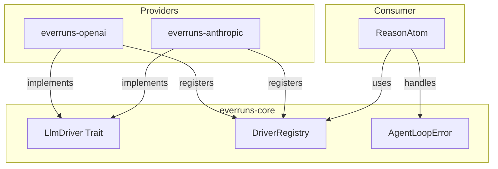
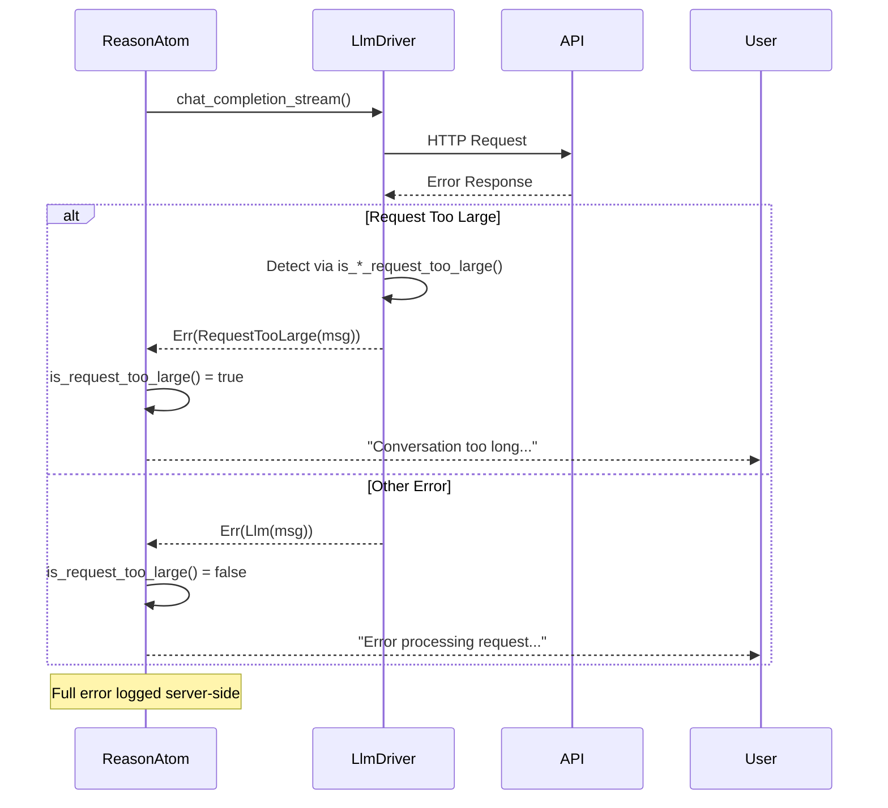

# LLM Drivers Specification

## Abstract

LLM drivers provide a provider-agnostic interface for interacting with Large Language Model APIs. The driver abstraction enables dependency inversion - provider implementations (OpenAI, Anthropic) register their drivers at startup, while core business logic operates against the trait interface.

## Architecture



## Requirements

### LlmDriver Trait

1. **Trait Definition** (`everruns-core::llm_driver_registry`):
   ```rust
   #[async_trait]
   pub trait LlmDriver: Send + Sync {
       async fn chat_completion_stream(
           &self,
           messages: Vec<LlmMessage>,
           config: &LlmCallConfig,
       ) -> Result<LlmResponseStream>;
   }
   ```

2. **Streaming Response**: Drivers MUST return a stream of `LlmStreamEvent`:
   - `TextDelta(String)` - Incremental text content
   - `ToolCalls(Vec<ToolCall>)` - Tool calls from the LLM
   - `Done(LlmCompletionMetadata)` - Stream completed with metadata
   - `Error(String)` - Error during streaming

3. **Provider Types**: Supported provider types are defined in `ProviderType` enum:
   - `OpenAI` - OpenAI API
   - `Anthropic` - Anthropic Claude API
   - `AzureOpenAI` - Azure OpenAI Service
   - `LlmSim` - Testing simulator (llmsim crate)

### Error Types (Contract)

Drivers MUST use the following error types from `AgentLoopError`:

1. **`Llm(String)`** - Generic LLM provider error
   - Use for: network errors, authentication failures, invalid requests, server errors
   - Example: `AgentLoopError::llm("OpenAI API error (500): Internal server error")`

2. **`RequestTooLarge(String)`** - Context length or token limit exceeded
   - Use for: context length exceeded, token limits hit, prompt too long
   - Drivers MUST detect provider-specific error responses and convert to this type
   - Example: `AgentLoopError::request_too_large("OpenAI API error (429): Request too large...")`

### Error Detection Requirements

Each driver MUST implement provider-specific error detection:

#### OpenAI Driver

Detect `RequestTooLarge` for:
- HTTP 429 with "Request too large" in message
- HTTP 429 with "tokens" and "limit" in message (TPM exceeded)
- HTTP 400 with "context_length_exceeded" code
- HTTP 400 with "maximum context length" in message
- Any response with "tokens must be reduced" or "reduce the length"

#### Anthropic Driver

Detect `RequestTooLarge` for:
- HTTP 413 (Payload Too Large)
- HTTP 400 with "prompt is too long" in message
- HTTP 400 with "request size exceeded" in message
- HTTP 400 with "too many tokens" in message
- Any response with "maximum context" or "exceeds the maximum"

### Driver Registry

1. **Registration**: Provider crates register factories at startup:
   ```rust
   pub fn register_driver(registry: &mut DriverRegistry) {
       registry.register(ProviderType::OpenAI, |api_key, base_url| {
           Box::new(OpenAILlmDriver::new(api_key, base_url))
       });
   }
   ```

2. **Creation**: Drivers are created on-demand from `ProviderConfig`:
   ```rust
   let driver = registry.create_driver(&config)?;
   ```

3. **API Key Requirement**: All real providers require API keys. `LlmSim` is exempted for testing.

### Message Types

1. **LlmMessage**: Provider-agnostic message format
   - `role`: System, User, Assistant, Tool
   - `content`: Text or multipart (text, images, audio)
   - `tool_calls`: Optional tool calls (assistant messages)
   - `tool_call_id`: Optional tool call reference (tool messages)

2. **LlmCallConfig**: Configuration for LLM calls
   - `model`: Model identifier
   - `temperature`: Optional sampling temperature
   - `max_tokens`: Optional token limit
   - `tools`: Tool definitions
   - `reasoning_effort`: Optional reasoning level (low, medium, high)

### Completion Metadata

`LlmCompletionMetadata` returned on stream completion:
- `total_tokens`: Total tokens used
- `prompt_tokens`: Input tokens
- `completion_tokens`: Output tokens
- `cache_read_tokens`: Tokens from cache (provider-specific)
- `cache_creation_tokens`: Tokens written to cache (Anthropic)
- `model`: Actual model used
- `finish_reason`: Why generation stopped

## Error Handling Flow



## Implementation Location

| Component | Location |
|-----------|----------|
| LlmDriver trait | `crates/core/src/llm_driver_registry.rs` |
| AgentLoopError | `crates/core/src/error.rs` |
| OpenAI driver | `crates/openai/src/driver.rs` |
| OpenAI protocol | `crates/core/src/openai_protocol.rs` |
| Anthropic driver | `crates/anthropic/src/driver.rs` |
| Error handling | `crates/core/src/atoms/reason.rs` |

## Testing

1. **Unit Tests**: Each driver MUST have tests for error detection functions
2. **LlmSim**: Use `ProviderType::LlmSim` for integration tests without real API keys
3. **Error Detection Tests**: Cover all documented error patterns for each provider
