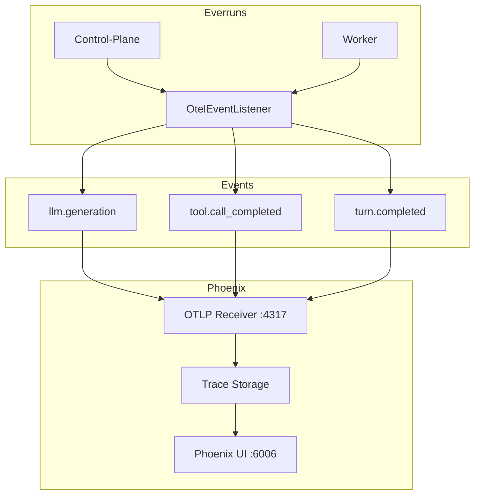

# Phoenix Observability Specification

## Abstract

Arize Phoenix provides LLM-specific observability for Everruns, enabling developers to trace, debug, and analyze LLM interactions. Phoenix is integrated via OpenTelemetry OTLP protocol and supports both OpenTelemetry gen-ai semantic conventions and OpenInference conventions for enhanced visualization.

## Architecture



## Requirements

### Deployment Options

1. **Local Development (Default)**:
   - Phoenix runs in Docker via `docker-compose.yml` with `phoenix` profile
   - `just start-all` starts Phoenix automatically
   - UI accessible at `http://localhost:6006`
   - OTLP endpoint at `localhost:4317`

2. **Self-Hosted Production**:
   - Deploy Phoenix container to Kubernetes or Docker Swarm
   - Configure `OTEL_EXPORTER_OTLP_ENDPOINT` to point to Phoenix

3. **Arize Cloud**:
   - Use Arize's managed Phoenix service
   - Configure endpoint and API key via environment variables

### Environment Variables

| Variable | Description | Default |
|----------|-------------|---------|
| `OTEL_EXPORTER_OTLP_ENDPOINT` | Phoenix OTLP endpoint | `http://localhost:4317` |
| `OTEL_EXPORTER_OTLP_HEADERS` | Headers for authentication (Arize Cloud) | - |
| `OTEL_SDK_DISABLED` | Disable tracing entirely | `false` |
| `OTEL_SERVICE_NAME` | Service name in traces | `everruns-*` |
| `OTEL_RECORD_CONTENT` | Record LLM input/output content | `false` |

### Semantic Conventions

Everruns emits both OpenTelemetry gen-ai and OpenInference attributes for maximum compatibility.

#### OpenTelemetry Gen-AI Attributes

| Attribute | Description |
|-----------|-------------|
| `gen_ai.operation.name` | Operation type (`chat`, `execute_tool`, `invoke_agent`) |
| `gen_ai.system` | Provider name (`openai`, `anthropic`) |
| `gen_ai.request.model` | Model identifier |
| `gen_ai.usage.input_tokens` | Prompt tokens used |
| `gen_ai.usage.output_tokens` | Completion tokens used |
| `gen_ai.response.finish_reasons` | Completion stop reason |
| `gen_ai.conversation.id` | Session ID for correlation |

#### OpenInference Attributes (Phoenix-Specific)

| Attribute | Description |
|-----------|-------------|
| `openinference.span.kind` | Span type (`LLM`, `TOOL`, `AGENT`) |
| `llm.model_name` | Model identifier |
| `llm.system` | AI product identifier |
| `llm.token_count.prompt` | Input tokens |
| `llm.token_count.completion` | Output tokens |
| `llm.token_count.total` | Total tokens |
| `session.id` | Session identifier |
| `tool.name` | Tool being executed |

### Span Types

1. **LLM Spans** (`openinference.span.kind=LLM`):
   - Created for each `llm.generation` event
   - Include token counts, latency, model info
   - Name format: `chat {model}`

2. **Tool Spans** (`openinference.span.kind=TOOL`):
   - Created for each `tool.call_completed` event
   - Include tool name, success status, duration
   - Name format: `execute_tool {name}`

3. **Agent Spans** (`openinference.span.kind=AGENT`):
   - Created for each `turn.completed` event
   - Include iteration count, aggregated token usage
   - Name format: `invoke_agent {turn_id}`

### Docker Configuration

Phoenix service in `local/docker-compose.yml`:

```yaml
phoenix:
  image: arizephoenix/phoenix:latest
  container_name: everruns-phoenix
  profiles:
    - phoenix
  ports:
    - "6006:6006"    # Phoenix UI
    - "4317:4317"    # OTLP gRPC
    - "4318:4318"    # OTLP HTTP
  environment:
    PHOENIX_ENABLE_PROMETHEUS: "false"
    PHOENIX_WORKING_DIR: /phoenix_data
  volumes:
    - phoenix_data:/phoenix_data
```

### Just Commands

| Command | Description |
|---------|-------------|
| `just start-all` | Start all services with Phoenix (default) |
| `just start-phoenix` | Start Docker with Phoenix profile only |
| `just start-docker` | Start Docker with Jaeger profile |
| `just stop-docker` | Stop all Docker services |

### Switching Between Backends

Phoenix and Jaeger use the same OTLP ports. To switch:

```bash
# Stop current backend
just stop-docker

# Start with Phoenix (default for start-all)
just start-phoenix

# Or start with Jaeger
just start-docker
```

## Implementation Details

### OtelEventListener

Location: `crates/core/src/observation/otel.rs`

The listener subscribes to domain events and creates OTLP spans:

```rust
impl EventListener for OtelEventListener {
    async fn on_event(&self, event: &Event) {
        match &event.data {
            EventData::LlmGeneration(data) => self.handle_llm_generation(event, data),
            EventData::ToolCallCompleted(data) => self.handle_tool_call_completed(event, data),
            EventData::TurnCompleted(data) => self.handle_turn_completed(event, data),
            _ => {}
        }
    }
}
```

### Telemetry Module

Location: `crates/core/src/telemetry.rs`

Defines semantic convention constants:

- `gen_ai::*` - OpenTelemetry gen-ai conventions
- `openinference::*` - OpenInference conventions for Phoenix

## Privacy Considerations

1. **Content Recording**: Disabled by default (`OTEL_RECORD_CONTENT=false`)
2. **Token Counts Only**: By default, only metrics are captured, not message content
3. **Session Correlation**: Uses session IDs for trace correlation without exposing user data

## Troubleshooting

### No Traces in Phoenix

1. Verify Phoenix is running: `docker ps | grep phoenix`
2. Check OTLP endpoint: `echo $OTEL_EXPORTER_OTLP_ENDPOINT`
3. Ensure `OTEL_SDK_DISABLED` is not `true`
4. Check service logs for OTLP connection errors

### Missing OpenInference Attributes

Ensure using Everruns v0.4.0+ which includes OpenInference support.

### Port Conflicts

Phoenix and Jaeger use the same ports (4317, 4318). Only run one at a time.
