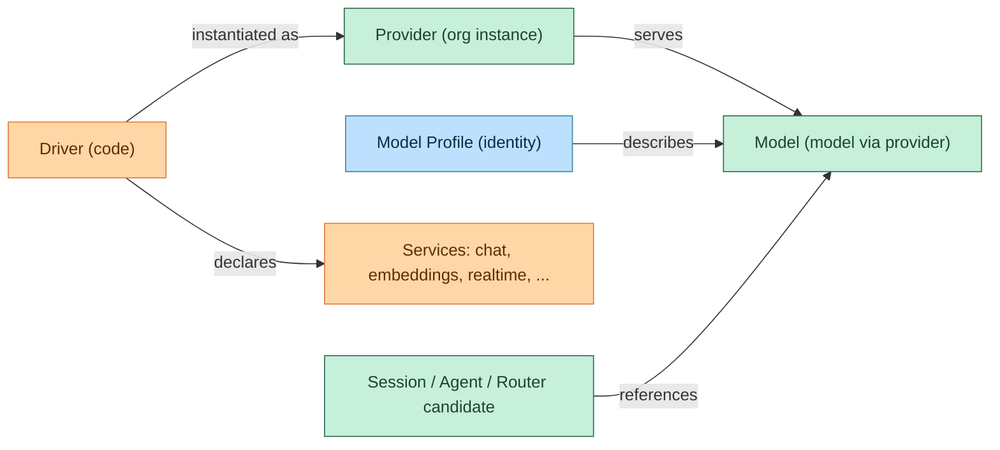

# Providers Specification

## Abstract

Providers are org-scoped accounts on AI service vendors (OpenAI, Anthropic, AWS Bedrock, OpenRouter, Azure OpenAI). A provider is configured once with credentials and connection settings, then powers one or more **services**: chat completion today; embeddings, realtime voice, images, and reranking as they land.

This spec replaces the "LLM providers" framing. The old name was wrong in a specific way: the database row was already a generic vendor account, but the code layer hard-wired it to exactly one service (chat completion), so every non-chat consumer grew a bypass. This is the canonical **target** domain model; implementation lands in the phases below. **There is no backward compatibility requirement**: old names (`llm_providers`, `llm_models`, `LlmProvider`, `provider_type`, `/v1/llm-providers`) will be removed everywhere — schema, code, API, UI, docs, and tests — as the refactor phases land, per the inventory below.

## Motivation

Evidence the old model was straining:

1. **Voice realtime** resolved credentials by hardcoded provider-type string (`"openai"`) against `llm_providers` because there was no way to ask for "the realtime service of a configured provider" (`crates/server/src/api/voice.rs`).
2. **Bedrock** smuggled a JSON credential bundle (access key, secret, region, session token) through the single `api_key` field — the credential model was too narrow.
3. **Embeddings had no home**: knowledge-base hybrid retrieval (`specs/knowledge-bases.md`) had no place to configure an embedding model, even though the same OpenAI/Gemini account already serves embeddings.
4. **Realtime models** (`gpt-realtime-2`) had to be hidden from chat pickers by special-casing because models had no service dimension.
5. **The same logical model** appeared as duplicate, unrelated rows per provider (`claude-sonnet-4-6` via Anthropic, `us.anthropic.claude-...` via Bedrock, `anthropic/claude-sonnet-4.6` via OpenRouter) with nothing connecting them, and bindings broke when a model was moved between providers.
6. **Naming collision**: integration connection plugins were also called "providers" (`ConnectionProviderPlugin`).

## Domain Model



| Entity | Scope | Meaning |
|---|---|---|
| **Driver** | Code | Technical implementation of a vendor API shape. Declares a credential schema, the set of services it supports, per-service client factories, and model discovery. Registered in `DriverRegistry`. |
| **Service** | Code | A typed capability a driver exposes: `chat`, `embeddings`, `realtime`, `images`, `rerank`, ... Only `chat` is implemented today; the set is additive. |
| **Provider** | Org | A configured instance of a driver: name, credentials, endpoint/zone, settings, status. Many providers may use the same driver (e.g. Azure OpenAI in two regions). |
| **Model** | Org | A specific model via a specific provider: provider FK + wire model id + operational flags. The unit that bindings reference. |
| **Model Profile** | Global | The model's identity and metadata: stable key, vendor, service kind, capabilities, limits, pricing. One profile describes N models (one per provider serving it). |

Connectors are the user-scoped sibling concept (see "Providers vs Connections" below): **Connector (code) → Connection (user instance)** mirrors **Driver (code) → Provider (org instance)**.

### Driver

A driver is a code unit registered in `DriverRegistry`, keyed by a **driver id** (`openai`, `azure_openai`, `openai_completions`, `openrouter`, `anthropic`, `gemini`, `bedrock`, `mai`, `fireworks`, `llmsim`). Ids are open, not a closed set: built-in drivers are compiled-in enum variants, and embedder-defined drivers register arbitrary ids via `ProviderType::External` (`register_external`, landed in EVE-561) through `PlatformDefinition` — an embedder adds a vendor without patching core. The database stores the id as a plain string; unknown ids parse to `External` rather than erroring.

The `mai` driver (`everruns-mai`) is a publishable example of a first-party built-in driver layered on a generic protocol: Microsoft MAI models (e.g. `mai-code-1-flash`) are served via Azure AI Foundry behind an OpenAI-compatible Chat Completions API, so the driver wraps `OpenAIProtocolChatDriver` and supplies authentication through the generic `AuthHeaderProvider` hook (see [llm-drivers.md](llm-drivers.md)). It is the only built-in driver besides `llmsim`/`External` that does not require an `api_key` at the registry layer, because it can authenticate via Microsoft Entra ID (OAuth) credentials supplied as first-class credential fields (or, on the embedder path, carried in `ProviderMetadata`).

Each registered driver declares:

- **Identity and display metadata** — driver id, display name, icon.
- **Credential schema** — the fields a provider instance must supply (see "Credentials"). Builds on the `DriverConfig` factory input (api_key + base_url + `ProviderMetadata`, landed in EVE-561) by adding the *declared* shape: form fields for the UI and `validate()`; Bedrock's multi-field credentials become a declared schema instead of JSON smuggled through `api_key`.
- **Services** — which `ServiceKind`s this driver implements. Declared in code, never stored in the database (no drift).
- **Per-service factories** — `chat(&ProviderConnection) -> Arc<dyn ChatDriver>` today; `embeddings(...)`, `realtime(...)` added when those services land. `ChatDriver` is the renamed `LlmDriver` trait; its wire contract (streaming, error types, retry, thinking, prompt cache, compaction) is unchanged and specified in [llm-drivers.md](llm-drivers.md).
- **Model discovery** — `list_models` against the provider account, used by model sync.

`ProviderConnection` is the resolved runtime input to factories: decrypted typed credentials + base URL + settings.

### Service

```rust
enum ServiceKind { Chat, Embeddings, Realtime, Images, Rerank }
```

Adding a service is additive: a new driver trait, a new factory slot on the driver, a service-kind value on model profiles, and a resolver entry point. No speculative service traits are built before their first consumer. `Embeddings` is the first shipped addition: `EmbeddingsDriver` trait wired to `OpenAIEmbeddingsDriver`; knowledge-base hybrid retrieval configuration (`embedding_model_id` on `knowledge_bases`) uses it — see `specs/knowledge-bases.md`.

### Provider

Org-scoped row in the `providers` table (renamed from `llm_providers`):

| Column | Notes |
|---|---|
| `id`, `org_id`, `name`, `status`, timestamps | As before. Public ID prefix stays `provider_`. |
| `driver` | Renamed from `provider_type`. String driver id, validated against the registry at the app layer. |
| `credentials_encrypted` | Replaces `api_key_encrypted` + `api_key_set`. AES-256-GCM envelope-encrypted JSON document matching the driver's credential schema (see `specs/encryption.md`). A derived `credentials_set` boolean is exposed via API; credential values are never returned. |
| `base_url` | Optional endpoint override, as before. |
| `settings` | JSONB, driver-specific settings, as before. |
| `last_synced_at` | Model-sync tracking, as before. |

Multiple providers per driver are first-class: two Azure OpenAI providers in different regions are two rows with `driver = 'azure_openai'`.

#### Trace links

Providers may expose deep links from session chats to the vendor's
observability dashboard ("trace"/"logs"). The mechanism is provider-agnostic
and template-based:

- A driver declares best-effort default URL templates
  (`DriverId::default_trace_templates`); OpenRouter points at its **Logs** page
  (`https://openrouter.ai/logs`, gated behind the account's "Input & Output
  Logging" Observability setting). OpenRouter does not document a public
  per-generation deep link, so the generation template passes the id best-effort.
- An org stores a per-provider override in `settings.trace`
  (`ProviderTraceConfig`: `enabled`, `generation_url_template`,
  `session_url_template`). Templates support the `{response_id}`,
  `{session_id}`, `{turn_id}` and `{model}` placeholders, so the same mechanism
  works for third-party backends (Langfuse, Helicone, ...) via an override. The
  UI substitutes placeholders, then renders the link only if the result is a
  valid `http(s)` URL (rejecting `javascript:`/`data:` schemes — the templates
  are admin-controlled but rendered as clickable links).
- The Provider API response carries the **resolved** config (driver defaults
  overlaid with the override). `enabled` defaults `false`: vendors retain
  prompt/completion content only when logging is turned on, so the org opts in
  once that is set up — this is the answer to "what if logs are not enabled".

The chat UI renders three link affordances when the session's provider has
trace links enabled: a session-level link in the session header (using the
forwarded `session_id` for grouping — see the OpenRouter section in
[integrations.md](integrations.md)), a per-turn link on the turn divider, and a
per-generation link beside each assistant message. The assistant message's
provider driver id and `response_id` are stamped onto the message metadata by
the reason atom so the UI can build the link without correlating events. Trace
config is keyed by driver id (the resolved model carries the driver, not the
provider instance id), so when an org runs multiple providers on one driver the
first trace-enabled provider for that driver supplies the templates.

### Model

Org-scoped row in the `models` table (renamed from `llm_models`). A model means **a specific model via a specific provider** — the concrete, callable unit:

| Column | Notes |
|---|---|
| `provider_id` | FK to `providers`. |
| `model_id` | Wire identifier sent to the provider API (Azure deployment name, Bedrock model id, OpenRouter slug). |
| `profile_key` | Explicit reference to the model profile (see below). Assigned at creation/sync; stored, visible, and correctable — never re-guessed at read time. |
| `enabled`, `is_favorite`, `source`, `last_seen_at`, `provider_metadata` | As before. |
| `display_name` | Optional override; defaults from the profile. |

Bindings (`session.model_id`, `agent.default_model_id`, model-router candidates) reference models. This is deliberate: model selection stays explicit and predictable, with no hidden "which provider serves this call" resolution step in the hot path. Cross-provider failover for the same logical model is expressed through Model Routers (`specs/model-router.md`) with candidates that share a profile — not through resolver magic.

Unique constraint `(provider_id, model_id)` stays. Where an API or UI needs to identify a model-through-a-provider pair, the language is "model X **via** provider Y"; there is no separate join entity or noun.

### Model Profile

The model's identity, promoted from a runtime-computed shadow type to a first-class public entity:

- **Stable key**: `"{vendor}/{model}"` (e.g. `anthropic/claude-sonnet-4.6`, `openai/gpt-5.5`, `openai/text-embedding-3-large`).
- **Service kind**: which service this model belongs to (`chat`, `embeddings`, `realtime`, ...). Pickers filter on it — chat pickers never show `gpt-realtime-2`; embedding configuration only shows embedding profiles. This removes the per-model special-casing the voice spec required.
- **Metadata**: vendor, default display name, capabilities (tools, vision, reasoning, structured output), limits, cost, modalities, reasoning-effort config — everything `LlmModelProfile` carries today (`crates/core/src/model.rs`), still sourced from models.dev cross-referenced with official provider docs (sourcing rules in `specs/models.md` apply unchanged).
- **Sources**: built-in code registry (as today) plus discovered profiles persisted from provider metadata (the OpenRouter `supported_parameters` path). Org-custom profiles are out of scope until self-hosted models need them.
- **Invariant**: every model row has a profile. Discovery that cannot match a known profile creates a minimal one (key derived from the wire id, service `chat`, no cost/limits data — never guessed).

Profile matching heuristics (version normalization, slug mapping) run at **sync/creation time** to assign `profile_key`; reads use the stored assignment.

## Resolution Contract

### Model-bound resolution (chat)

Unchanged in shape: binding → model row → provider row → decrypt credentials → driver chat factory. The **fail-closed key resolution contract** in [llm-drivers.md](llm-drivers.md) (database-only in tenant paths, no env fallback, startup materialization rules, the `resolve_provider_api_key_env_key_set_does_not_leak` invariant) carries over verbatim with `credentials_encrypted` in place of `api_key_encrypted`. The resolver service is renamed `LlmResolverService` → `ProviderResolverService`.

### Service-bound resolution (non-chat)

New entry point for consumers that need a service rather than a chat model:

```
resolve_service(org, ServiceKind, binding) -> (ProviderConnection, service client)
```

Selection: explicit `provider_id` on the consumer's binding (e.g. the voice connection's `provider_id` field) wins; otherwise an org-level default provider per service; otherwise the single active provider whose driver declares the service. "First active provider matching a type string" — the old voice behavior — is removed. Resolution failures surface structured "no provider configured for {service}" errors, fail-closed.

All three tiers are implemented. The org-default-per-service tier reads an org-settings map (`organization_settings.default_provider_per_service`, `ServiceKind` → provider id) set via `PATCH /v1/orgs/{org}` (`default_provider_per_service`). It is consulted only when no explicit binding is supplied, and it is fail-closed: a configured default that is missing, inactive, or whose driver does not declare the service errors rather than falling through to the active-provider scan. An unset default for a service falls through to that scan as before. Voice realtime plumbs the per-connection binding: the create/attach request bodies carry an optional `provider_id` (the realtime provider connection's public id), passed straight through as `resolve_service(org, Realtime, provider_id)`. When omitted it falls back to the org default (or the single realtime-capable provider); an unknown binding or one whose driver does not declare the realtime service is rejected with `400` rather than the generic provider `502`. The resolved provider id is persisted on the voice connection's leased-resource metadata.

Consumers and their paths:

| Consumer | Path |
|---|---|
| Agent chat turns | Model-bound resolution (above) |
| Voice realtime | `resolve_service(org, Realtime, voice_connection.provider_id)` — optional per-connection `provider_id` binding on the create/attach bodies; omitted falls back to the org default or the single realtime-capable provider; an unknown/non-realtime binding is a `400` |
| Knowledge-base embeddings (future) | `resolve_service` with an embedding model selection |
| Model sync | Per-provider, via the driver's `list_models` with the provider's connection |
| Utility LLM | **Not a provider consumer.** Stays system-owned and env-configured by design (`specs/utility-llm.md`) |
| Usage tracking | Unchanged: records provider/model as event-sourced strings, not FKs (`specs/usage-tracking.md`) |

## Credentials

The credential schema is a shared primitive between drivers and connectors:

- **Schema**: named fields with a type (`password`, `text`, `url`), required flag, optional placeholder / help text / default value, and optional mutually-exclusive **group** label. Drivers and connectors declare schemas the same way (`crates/core/src/credential_schema.rs`); the Settings UI renders both with one form component that lays out discrete typed inputs (multi-field credentials, grouped alternatives) — no hand-authored JSON.
- **Validation**: ungrouped required fields must be present; fields sharing a group label form one alternative method, and at least one group must be complete (`CredentialFormSchema::validate`). Connectors additionally declare async `validate()` against the upstream API.
- **Storage**: the submitted field map is assembled into one credential document (`assemble_credential_document`) and encrypted with the AES-256-GCM envelope (`specs/encryption.md`); values are never returned by any API. A lone `api_key` is stored as the raw key; multi-field credentials are stored as a JSON object keyed by field name. At driver-construction time the document is parsed back into the typed `DriverConfig::credentials` map (`parse_credential_document`), the single point where the stored string becomes typed fields for every path (server, worker, sync, dev).

Simple drivers declare a one-field schema (`api_key`). **Bedrock** declares `access_key_id`, `secret_access_key`, optional `region`, optional `session_token`. **MAI** declares two grouped methods — an Azure AI Foundry `api_key`, or first-class Microsoft Entra ID OAuth fields (`tenant_id`, `client_id`, `client_secret`, optional `scope`/`authority`). Their drivers read the typed `DriverConfig::credentials` fields rather than parsing JSON out of `api_key`. The provider's endpoint stays the first-class `base_url`, not a credential field.

Because the stored document is keyed by field name, existing Bedrock/MAI rows (which already hold such a JSON document) and existing single-key rows resolve unchanged — no re-encryption or data migration is required.

Env-var fallbacks for dev (`DEFAULT_*_API_KEY`, startup materialization into the default org) keep their existing semantics, mapped onto the credential document.

Driver crates do **not** read the process environment for credentials. Credentials reach a driver through its constructor or `DriverConfig` (resolved from the encrypted database on the server path). Env-based loading for standalone/dev/CLI use is the single, injectable `CredentialProvider`/`EnvCredentialProvider` seam in `crates/core/src/credential_provider.rs`; the server never constructs an `EnvCredentialProvider`. See the Key Resolution Contract in [llm-drivers.md](llm-drivers.md).

### OAuth provider connection

A driver may additionally declare an **interactive OAuth connect flow** so an org admin can connect a provider by authorizing in the browser instead of pasting a key. This is a second way to *populate* the credential document, not a second credential model: the flow always ends by writing a long-lived credential into `credentials_encrypted`, exactly where a hand-typed key lands. Runtime resolution is unchanged, and non-admin users are unaffected — they never authorize; they use models served by the org provider against the one stored credential, as before.

The capability is declared, not special-cased, mirroring services and credential schema:

- `DriverDescriptor::oauth: Option<DriverOAuthConfig>` (`crates/core/src/driver_registry.rs`). `Some` makes "Connect with {provider}" available; `None` means manual entry only. `DriverOAuthConfig` carries the authorize/token endpoints and a `DriverOAuthFlow` wire-flavor discriminator. Adding OAuth to another driver is filling in this field plus a `DriverOAuthFlow` variant — **no new endpoints**.
- Two org-scoped endpoints under the existing provider resource drive every OAuth driver: `GET /v1/providers/{id}/oauth/authorize` (redirects to the provider with PKCE) and `GET /v1/providers/{id}/oauth/callback` (exchanges the code, stores the credential, redirects to Settings → Providers). Both require `provider.manage`.

**OpenRouter** is the first driver to declare it (`DriverOAuthFlow::OpenRouterPkce`). OpenRouter's one-click PKCE flow returns a *user-controlled API key*; the admin authorizes once and the key is stored org-wide. PKCE uses a public client (no client id/secret or app registration). Note OpenRouter's callback URL must be HTTPS on port 443 or 3000 for non-localhost deployments.

**Security model.** The flow is CSRF-protected by an HttpOnly, `SameSite=Lax`, 10-minute state cookie bound to the provider id, org id, and the browser's PKCE verifier; the CSRF token also rides in the callback URL so it round-trips regardless of provider echo behavior. The callback re-checks `provider.manage` and validates the cookie before storing anything, so a forged callback cannot inject an attacker's credential. The token-exchange endpoint is driver-declared (not user input) and still passes SSRF validation as defense-in-depth.

## Providers vs Connections

Two deliberately separate front doors over shared plumbing:

| | **Provider** | **Connection** |
|---|---|---|
| Scope | Organization | User |
| Purpose | Infrastructure that runs agents; spends org money | User's identity on an external service, used by tools |
| Configured by | Org admins (Settings → Providers) | Each user (Settings → Connections) |
| Resolution | Per LLM/service call, cached, **fail-closed** | Lazy at tool execution time |
| Visibility | Org-visible | Private to the owning user |
| Code unit | Driver (`DriverRegistry`) | Connector (plugin registry) |

They are not merged: merging would entangle the fail-closed billing invariant with the user-privacy model of connections. What they share is the descriptor layer — credential schema, validation, encryption, form rendering — so adding a new provider driver feels exactly like adding a new connector.

Terminology cleanup on the connector side: `ConnectionProviderPlugin` and "connection provider" become **connector** (`ConnectorPlugin`), eliminating the second meaning of "provider". See `crates/server/specs/user-connections.md`.

## API Surface

Renames, no compatibility aliases:

| Old | New |
|---|---|
| `GET/POST /v1/llm-providers` | `GET/POST /v1/providers` |
| `GET/PATCH/DELETE /v1/llm-providers/{id}` | `GET/PATCH/DELETE /v1/providers/{id}` |
| `POST /v1/llm-providers/{id}/sync-models` | `POST /v1/providers/{id}/sync-models` |
| `GET /v1/llm-providers/config` | `GET /v1/providers/config` |
| `GET/POST /v1/llm-providers/{id}/models` | `GET/POST /v1/providers/{id}/models` |
| `GET /v1/llm-models`, `/v1/llm-models/{id}` | `GET /v1/models`, `/v1/models/{id}` |
| — | `GET /v1/model-profiles`, `GET /v1/model-profiles/{vendor}/{model}` (read-only catalog; the key's two segments map to two path segments, so the embedded `/` never needs URL-encoding) |
| — | `GET /v1/models/{id}/siblings` (models sharing the profile — powers "rebind via another provider") |

Request/response field renames follow: `provider_type` → `driver`, `api_key` → typed credential fields per schema, `api_key_set` → `credentials_set`. Model responses gain `profile_key` and embed the profile (as `LlmModelWithProvider.profile` does today).

## Refactor Inventory (no legacy left behind)

The acceptance bar for this refactor: `rg -i "llm_provider|llm-provider|LlmProvider|llm_model|llm-model|LlmModel|provider_type"` returns no hits outside migration history and CHANGELOG. Migrations rename in place (PostgreSQL `ALTER TABLE ... RENAME`); per `specs/migrations.md`, no data is dropped.

| Area | Work |
|---|---|
| DB | Rename `llm_providers` → `providers`, `llm_models` → `models`; `provider_type` → `driver`; `api_key_encrypted` → `credentials_encrypted` (existing keys wrapped as `{"api_key": ...}` documents — re-encryption not required, the envelope is unchanged); add `models.profile_key` (backfilled via the existing normalization matcher); persisted discovered profiles table. FKs (`model_routers`, sessions/agents bindings) follow renames. |
| Core (`crates/core`) | `llm_models.rs` → `provider.rs`/`model.rs` types (`Provider`, `Model`, `ModelProfile`, `ServiceKind`); `driver_registry.rs`: `LlmDriver` → `ChatDriver`, registry keyed by string driver id, driver descriptor with credential schema + service factories; `traits.rs`: `LlmProviderStore` → `ProviderStore`; `llm_model_profiles.rs` → profile registry with stable keys. |
| Driver crates (`crates/openai`, `anthropic`, `gemini`, `bedrock`) | Register as driver descriptors (credential schema, services, factories). Bedrock drops JSON-in-api_key parsing in favor of its schema. |
| Server | Storage layer, repositories, domains, `seed.rs`, `llm_resolver.rs` → `provider_resolver.rs` (+ `resolve_service`), `model_sync.rs`, API modules `llm_providers.rs`/`llm_models.rs` → `providers.rs`/`models.rs`, OpenAPI schema, voice credential resolution rerouted through `resolve_service`. |
| Worker / runtime / CLI / examples | Adapter types and gRPC contracts follow core renames. |
| UI (`apps/ui`) | `lib/api/llm-providers.ts` → `providers.ts`, hooks, Settings → Providers pages (credential forms rendered from driver schemas), model pages grouped by profile with provider as secondary dimension, service-kind filtered pickers. |
| Connector side | `ConnectionProviderPlugin` → `ConnectorPlugin`; shared credential-schema/validation primitives extracted; `crates/server/specs/user-connections.md` updated. |
| Specs & docs | `specs/llm-drivers.md` restructured to the ChatDriver wire contract (entity/resolution/key-management content moves here); `specs/concepts.md`, `specs/models.md`, `specs/voice.md`, `specs/usage-tracking.md`, `specs/knowledge-bases.md`, `docs/` (including `docs/how-to/migrate-providers.md`), `test_cases/` updated to the new vocabulary. |
| Tests | Unit/integration/repository tests follow renames; new coverage: credential-schema validation, profile assignment at sync, `resolve_service` selection and fail-closed behavior, multi-provider-per-driver resolution. The fail-closed env-leak test is preserved under the new resolver name. |

## Phasing

PR-sized slices, each leaving the tree green and self-consistent (code + specs + tests move together):

1. **Core domain types and registry** — `ServiceKind`, driver descriptor with credential schema and service factories (building on `DriverConfig`/`External` from EVE-561), `ChatDriver` rename, profile keys. No DB change.
2. **DB + storage rename** — migrations, storage traits, repositories, seeds, resolver rename, `profile_key` backfill.
3. **API + UI rename** — routes, OpenAPI, UI pages/hooks/clients, profile catalog endpoint, picker grouping.
4. ✅ **Service resolution** — `resolve_service(org, ServiceKind, binding)` (all three tiers: explicit binding, org-level default-provider-per-service, and active-provider-declaring-service), voice realtime rerouted through it (`ServiceKind::Realtime`, fail-closed). The org default-per-service tier (EVE-569) is stored on `organization_settings.default_provider_per_service` and editable via the org PATCH API + Settings → Providers.
5. **Connector alignment** — shared credential primitives, `ConnectorPlugin` rename.
6. ✅ **First new service** — `EmbeddingsDriver` + knowledge-base hybrid retrieval configuration (closes the open question in `specs/knowledge-bases.md`).

## Design Decisions

| Question | Decision | Rationale |
|---|---|---|
| Rename registry to ProviderRegistry? | No — stays `DriverRegistry` | A driver is the technical implementation; a provider is an instance using it. Many providers per driver (Azure zones). |
| Registry key: enum or string? | Open driver ids: built-in enum variants + `External(Arc<str>)` for embedder ids (EVE-561) | Embedder-extensible via `PlatformDefinition`; DB stores the id as a plain string; unknown ids parse to `External`. |
| Where do services live? | Declared by the driver in code | DB storage would drift from what the code can actually do. |
| Separate join entity between model and provider? | No | A model *is* "a specific model via a specific provider" — the join. `(provider_id, model_id)` is unique; "model X via provider Y" needs no third noun. |
| What do bindings reference? | Concrete models | Explicit and predictable; no hidden provider selection per call. Cross-provider failover is a Model Router concern (candidates sharing a profile). |
| Model identity layer? | Promote Model Profile | It already existed as a runtime-computed shadow; promotion (stable public key, stored assignment) beats inventing a new entity. |
| Merge providers and connections? | No | Different scope, trust model, and resolution path; share only the credential descriptor plumbing. |
| Utility LLM through providers? | No | Deliberate system-owned exception (`specs/utility-llm.md` non-goals). |
| Backward compatibility? | None | Pre-1.0 internal domain; renames are clean cuts. Migrations preserve data, not names. |

## Source Index

The refactor has landed; current implementations live at:

- `crates/core/src/provider.rs` — `Provider` entity + `DriverId`
- `crates/core/src/model.rs` — `Model` / `ModelWithProvider` entity types
- `crates/core/src/model_profiles.rs` — built-in profile data
- `crates/core/src/driver_registry.rs` — `ChatDriver` trait + `DriverRegistry` (string-keyed driver ids, credential schema + service factories); `DriverConfig` typed `credentials` map
- `crates/core/src/credential_schema.rs` — declared credential form schema (typed fields, groups, validation) + credential-document assemble/parse
- `crates/core/src/traits.rs` — `ProviderStore` + `ResolvedModel`
- `crates/server/src/services/provider_resolver.rs` — fail-closed resolution (`resolve_service`)
- `crates/server/src/services/model_sync.rs` — model discovery
- `crates/server/src/api/providers.rs`, `crates/server/src/api/models.rs` — REST API
- `crates/server/src/api/voice.rs` — realtime credential resolution (routed through `resolve_service`)
- `crates/core/src/connector.rs` — connector plugin trait
- `apps/ui/src/app/(main)/settings/providers/` — provider settings UI
